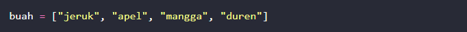
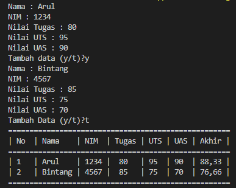

# Pertemuan 9 

### Nama  : Muhammad Ilham Sofyan Saifudin
### Kelas : TI 22 A3
### NIM   : 312210297

## List
#### Dalam bahasa pemrograman Python, struktur data yang paling dasar adalah urutan atau lists. Setiap elemen-elemen berurutan akan diberi nomor posisi atau indeksnya. Indeks pertama dalam list adalah nol, indeks kedua adalah satu dan seterusnya.List adalah struktur data pada python yang mampu menyimpan lebih dari satu data, seperti array.
#### List dibuat dengan menempatkan elemen di dalam kurung siku [], dan dipisahkan dengan tanda koma.
#### Contoh:

### Akses Nilai Dalam List Python
#### Untuk mengakses nilai dalam list python, gunakan tanda kurung siku untuk mengiris beserta indeks atau indeks untuk mendapatkan nilai yang tersedia pada indeks tersebut.
#### Berikut adalah contoh cara mengakses nilai di dalam list python :

#### Setelah Anda mengeksekusi kode diatas, hasilnya akan seperti dibawah ini 

### Memperbarui Nilai Dalam List Python
#### Anda dapat memperbarui satu atau beberapa nilai di dalam list dengan memberikan potongan di sisi kiri operator penugasan, dan Anda dapat menambahkan nilai ke dalam list dengan metode append ().Contoh :

### Menghapus Nilai Dalam List Python
#### Untuk menghapus nilai di dalam list python, Anda dapat menggunakan salah satu pernyataan del jika Anda tahu persis elemen yang Anda hapus. Anda dapat menggunakan metode remove() jika Anda tidak tahu persis item mana yang akan dihapus.Contoh :

### Operasi Dasar Pada List Python
#### List Python merespons operator + dan * seperti string; Itu artinya penggabungan dan pengulangan di sini juga berlaku, kecuali hasilnya adalah list baru, bukan sebuah String.Contohnya:

### Hasil Tugas Praktikum

